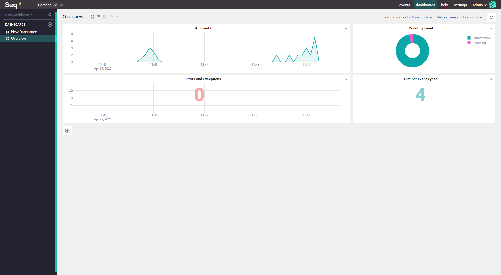

# altkom-orange-dotnet-core-web

## EF Core

### Przydatne komendy CLI
- ``` dotnet ef ``` - weryfikacja instalacji
- ``` dotnet ef migrations add {migration} ``` - utworzenie migracji
- ``` dotnet ef migrations remove ``` - usunięcie ostatniej migracji
- ``` dotnet ef migrations list ``` - wyświetlenie listy wszystkich migracji
- ``` dotnet ef migrations script ``` - wygenerowanie skryptu do aktualizacji bazy danych do najnowszej wersji
- ``` dotnet ef database update ``` - aktualizacja bazy danych do najnowszej wersji
- ``` dotnet ef database update -verbose ``` - aktualizacja bazy danych do najnowszej wersji + wyświetlanie logu
- ``` dotnet ef database update {migration} ``` - aktualizacja bazy danych do podanej migracji
- ``` dotnet ef database drop ``` - usunięcie bazy danych
- ``` dotnet ef dbcontext info ``` - wyświetlenie informacji o DbContext (provider, nazwa bazy danych, źródło)
- ``` dotnet ef dbcontext list ``` - wyświetlenie listy DbContextów
- ``` dotnet ef dbcontext scaffold {connectionstring} Microsoft.EntityFrameworkCore.SqlServer -o Models ``` - wygenerowanie modelu na podstawie bazy danych

### Przydatne polecenia PMC
- ``` Add-Migration {migration} ``` - utworzenie migracji
- ``` Remove-Migration ``` - usunięcie ostatniej migracji
- ``` Script-Migration ``` - wygenerowanie skryptu do aktualizacji bazy danych do najnowszej wersji
- ``` Update-Database ``` - aktualizacja bazy danych do najnowszej wersji
- ``` Update-Database -verbose ``` - aktualizacja bazy danych do najnowszej wersji + wyświetlanie logu
- ``` Update-Database -migration {migration} ``` - aktualizacja bazy danych do podanej 
- ``` Scaffold-DbContext {connectionstring} Microsoft. Models ``` - wygenerowanie modelu na podstawie bazy danych

## WebHost.CreateDefaultBuilder
Co się kryje pod metodą WebHost.CreateDefaultBuilder?
https://github.com/sulmar/altkom-dotnet-core-201910/issues/1

## Signal-R
Javascript Signal-R client
https://docs.microsoft.com/en-us/aspnet/signalr/overview/getting-started/tutorial-getting-started-with-signalr

## Autentykacja
### Basic Authentication

### Windows Authentication
https://www.c-sharpcorner.com/article/configure-windows-authentication-in-asp-net-core/

### OAuth 2.0 

### JWT Token
https://jwt.io

Przykład implementacji:
https://github.com/sulmar/dotnet-core-jwt


## Logowanie zdarzeń (Serilog)
Serilog umożliwia zbieranie informacji o działaniu naszej aplikacji podobnie jak NLog lub log4net.
Serilog ma jednak tą zaletę, że umożliwia zapisywanie informacji w sposób strukturalny (json, xml) a nie tylko płaskiego pliku tekstowego. Dzięki temu można łatwo odczytać zmienne wartości i na ich podstawie definiować miary.


- Instalacja 
~~~ bash
dotnet add package Serilog.AspNetCore
~~~

### Konfiguracja za pomocą metod
~~~ csharp
public static void Main(string[] args)
{
    Log.Logger = new LoggerConfiguration()
        .WriteTo.Console()
        .WriteTo.File("logs/log.txt", rollingInterval: RollingInterval.Day)
        .WriteTo.File(new CompactJsonFormatter(), "logs/log.json")
        .CreateLogger();

	try
    {
        Log.Information("Application starting");

        CreateHostBuilder(args).Build().Run();
    }
    catch (Exception ex)
    {
	    Log.Fatal(ex, "The application failed to start correctly.");
    }
    finally
    {
	    Log.CloseAndFlush();
    }
}
~~~

- Dodaj *UseSerilog()*
~~~ csharp
public static IHostBuilder CreateHostBuilder(string[] args) =>
            Host.CreateDefaultBuilder(args)               
                .ConfigureWebHostDefaults(webBuilder =>
                {
                    webBuilder.UseStartup<Startup>();
                })
                .UseSerilog();

~~~


### Konfiguracja za pomocą pliku konfiguracyjnego

- Dodaj konfigurację Serilog do pliku _appsettings.json_
~~~ json
{
  
  "Serilog": {

    "Using": [],
    "MinimumLevel": {
      "Default": "Information",
      "Override": {
        "Microsoft": "Warning",
        "System": "Warning"
      }
    },

    "Enrich": ["FromLogContext", "WithMachineName", "WithProcessId", "WithThreadId"],

    "WriteTo": [
      {
        "Name": "Console"
      },
      {
        "Name": "File",
        "Args": {
          "path": "logs\\log.txt",
          "outputTemplate":  "{Timestamp:G} {Message}{NewLine:1}{Exception:1}"
        }
      },

      {
        "Name": "File",
        "Args": {
          "path": "logs\\log.json",
          "formatter": "Serilog.Formatting.Json.JsonFormatter, Serilog"
        }
      }
    ]
  },
}
~~~


### Logowanie własnych informacji

~~~ csharp

 public class IndexModel : PageModel
    {
        private readonly ILogger<IndexModel> _logger;

        public IndexModel(ILogger<IndexModel> logger)
        {
            _logger = logger;
        }

        public void OnGet()
        {
            _logger.LogInformation("You requested the Index page");
        }
    }
~~~

- Rezultat
~~~
[11:49:12 INF] You requested the Index page
~~~

### Logowanie informacji o żądaniach (requests)

~~~ csharp 
public void Configure(IApplicationBuilder app, IWebHostEnvironment env)
{
    app.UseSerilogRequestLogging();
}
~~~

- Rezultat
~~~
[11:45:50 INF] HTTP GET / responded 200 in 243.4293 ms
[11:45:57 INF] HTTP GET /documents/dokumenty/ responded 200 in 1611.0590 ms
[11:57:20 INF] HTTP GET /customers/ responded 200 in 167.5039 ms
~~~


### Sinks

Serilog umożliwia wysyłanie informacji o logach do różnych miejsc i nazywane są **Sinks**

- Dostępne pakiety
https://github.com/serilog/serilog/wiki/Provided-Sinks


### Enrich
Serilog umożliwia wzbogacanie logowanych informacji o dodatkowe informacje, np. nazwa maszyny, identyfikator procesu, nazwa środowiska lub nazwa użytkownika.

- Dostępne pakiety
https://github.com/serilog/serilog/wiki/Enrichment


## Wizualizacja za pomocą **Seq**
Ręczna analiza tekstowych logów może być trudna zwłaszcza jeśli chcemy uzyskać średnie w czasie, np. ilość requestów na minutę. Z pomocą przychodzi webowe narzędzie Seq.
Seq umożliwia zbieranie danych w czasie rzeczywistym i prezentację ich w postaci tabel i wykresów.


https://datalust.co/seq

1. Instalacja Seq

- Windows
https://datalust.co/download

- Docker
~~~ bash
docker run --name seq -d --restart unless-stopped -e ACCEPT_EULA=Y -p 5341:80 datalust/seq:latest
~~~
 
2. Instalacja biblioteki do Serilog
~~~ bash
dotnet add package Serilog.Sinks.Seq
~~~

3. Wpis do pliku konfiguracyjnego w appsettings.json
  
~~~ json
 {
        "Name": "Seq",
        "Args": {
          "serverUrl": "http://localhost:5341"
        }
}
~~~


5. Uruchom swoją aplikację i przejdź do adresu http://localhost:5341, aby śledzić statystyki.




